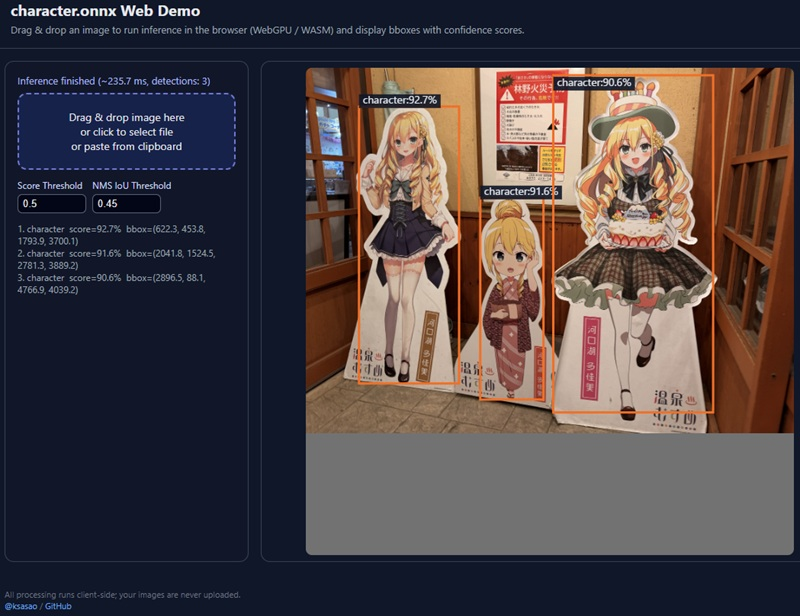

# anime-character-detector
YOLOX-based anime character detector running in browser with ONNX Runtime Web (WebGPU/WASM)

## Links

- **Web Demo**: [https://ksasao.github.io/anime-character-detector/](https://ksasao.github.io/anime-character-detector/)
- **Model Download**: [docs/character.onnx](docs/character.onnx)
- **Python Code**: [python/](python/)

## Model Information

| Property | Value |
|----------|-------|
| Base Model | YOLOX-s |
| mAP@50 | 78.4% |
| Training Images | 1,557 |
| Bounding Boxes | 8,663 |
